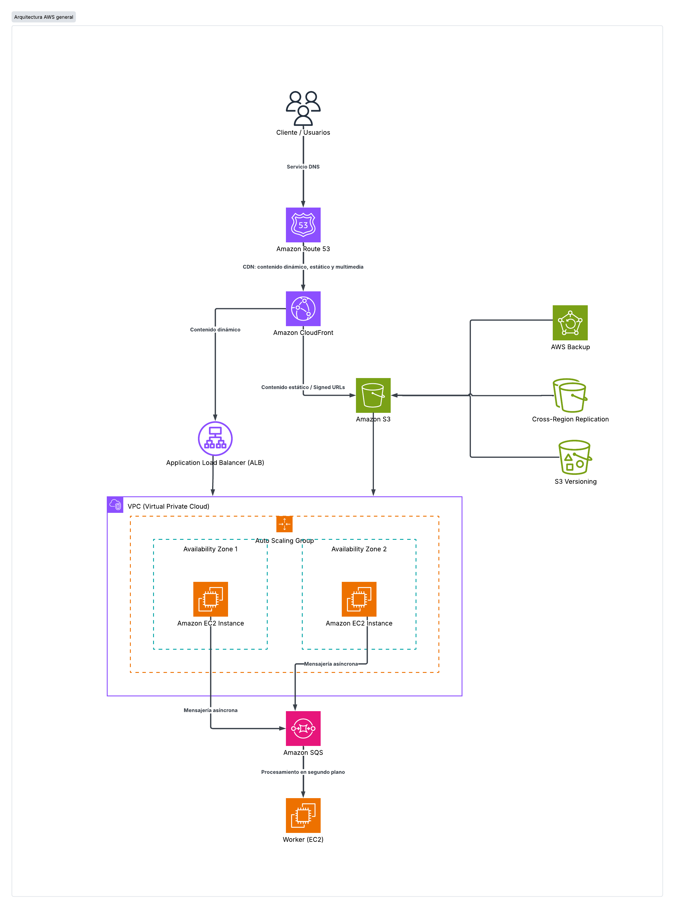

# Portafolio N°5: Arquitecturas Cloud Básicas y Resilientes en AWS

## Resumen del Proyecto
Diseño e implementación de una infraestructura en la nube escalable, disponible, segura y eficiente en costos, basada en los principios del **AWS Well-Architected Framework**.

## Componentes Técnicos
- **Almacenamiento de Objetos:** Amazon S3 con desacoplamiento de cómputo.
- **Resiliencia & Backup:** S3 Versioning, AWS Backup y Replicación entre buckets.
- **Nube Híbrida:** Conexión privada desde infraestructura local mediante AWS Direct Connect.
- **CDN & Seguridad:** Amazon CloudFront con Signed URLs/Cookies para protección del origen.
- **Procesamiento Asíncrono:** Amazon SQS para el desacoplamiento de tareas pesadas en segundo plano.

## Diagrama de Arquitectura
